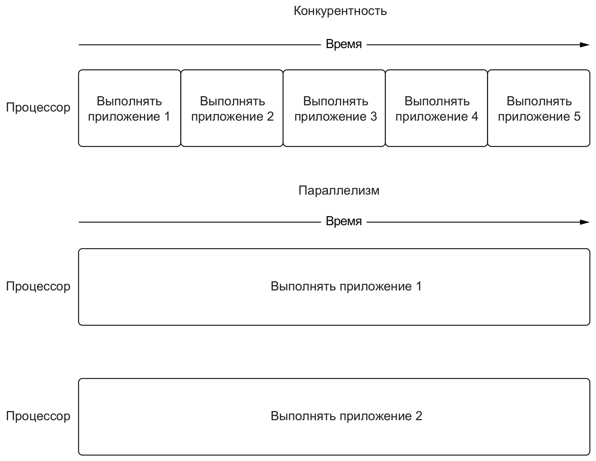
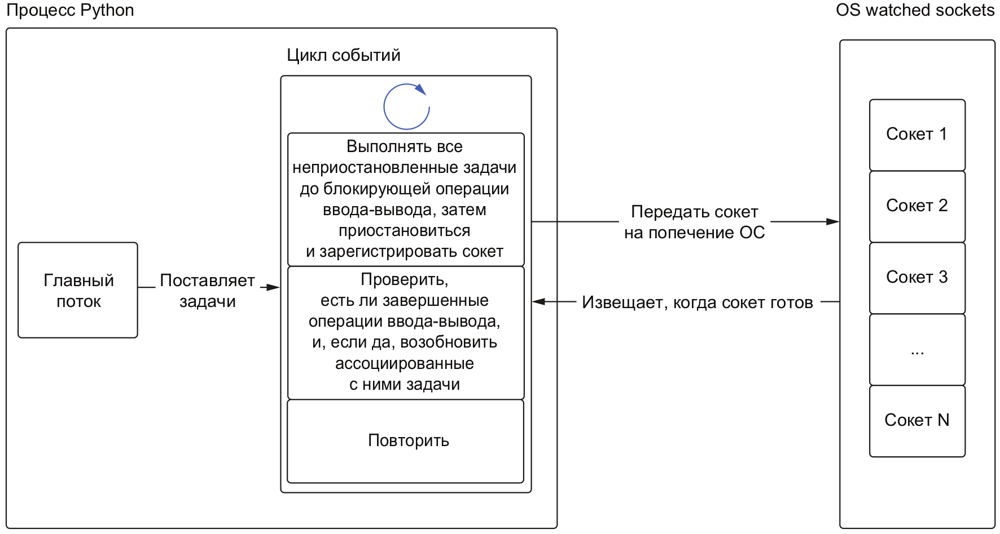

```threading, concurrent.futures, multiprocessing, asyncio```

**Модели вычислений**

Это способы организации вычислительных процессов:

• как выполняются вычисления

• какие ресурсы используются

• как они взаимодействуют друг с другом

• какие ограничения на них накладываются

**Последовательная модель**

Вычисления выполняются пошагово, каждый шаг завершает одну операцию, прежде чем приступить к
следующей

Эта модель не предполагает приостановку одной задачи, чтобы выполнить другую

# Конкурентность | Параллелизм
**Конкурентность** - две или более задач выполняются в одно и то же время - мы можем переключаться между
ними, дав немного поработать сначала одной, а потом другой задаче

**Параллелизм** - две или более задач не просто чередуются, а выполняются строго одновременно - активны в
одно и то же время

Конкурентность можно организовать имея процессор всего с одним ядром, а параллелизм возможен только
на многоядерном процессоре

# Многопоточность
**Процесс** - работающее приложение, которому выделена область памяти, недоступная другим приложениям

**Поток (Thread)** - это минимальная единица работы, запланированная для выполнения операционной системой:

• создаются в рамках одного процесса

• разделяют с ним ресурсы (память, файловые дескрипторы и д.р.)

С одним процессом всегда ассоциирован один поток - **главный**

Процесс может создавать дополнительные потоки, которые
могут конкурентно выполнять задачи - это называется
**многопоточностью**

**Многопоточность** — это способ организации работы программ, при котором они могут выполнять несколько операций одновременно, используя отдельные "потоки" внутри одного процесса. Каждый поток может выполнять свою задачу независимо от других потоков.

Пример из жизни

Представьте, что вы находитесь в кафе, где один бариста готовит кофе. Если много клиентов пришло одновременно, им придётся ждать своей очереди. Теперь представьте, что в кафе работают несколько бариста. Каждый из них может готовить кофе для разных клиентов одновременно. Это значительно ускоряет обслуживание и делает его более эффективным. В этом примере бариста — это потоки, а заказы на кофе — задачи, которые программа должна выполнить.

Пример и результат - **ThreadPoolExecutor**
```python
 concurrent.futures import ThreadPoolExecutor
import itertools
def multi_thread_concurrent(n: int, max_workers: int | None = None) -> list[int]:
    data_range = range(1, n + 1)
    
    with ThreadPoolExecutor(max_workers) as executor:
        results = executor.map(is_prime_number, data_range)
        return list(itertools.compress(data_range, results))12345678910
```
Замер на i7-7700K (4 ядра/8 потоков), количество потоков 12:
```python
>>> import timeit
>>>
>>> timeit.timeit(lambda: get_prime_numbers(10000), number=25)
4.640567486999998
>>> timeit.timeit(lambda: multi_thread_concurrent(10000), number=25)
8.37458275900002
>>>
>>> import os
>>> timeit.timeit(lambda: multi_thread_concurrent(10000, os.cpu_count() - 1), number=25)
8.937164508999558
```

| Характеристика       | `submit()`                                        | `map()`                               |
|----------------------|---------------------------------------------------|---------------------------------------|
| Использование         | Для одной функции с произвольными аргументами     | Для одной функции с итерабельным объектом |
| Возвращаемое значение | Объект `Future`  (.result() - получить результат) | Итератор результатов                  |
| Гибкость             | Более гибкий (можно использовать разные функции)  | Менее гибкий (одна функция для всех) |
| Удобство             | Требует явного управления результатами            | Проще в использовании для повторяющихся задач |

# Что такое GIL в Python?
**Глобальная блокировка интерпретатора** - в один момент времени разрешает только одному потоку управлять
интерпретатором Python

CPU-bound задачи:

• нагружают процессор (любая математика)

• для решения таких задач стоит использовать процессы
IO-bound задачи:

• зависят от ввода-вывода (работа с файлами, сетевые операции, запросы к БД)

• для решения таких задач идеально подходит многопоточность

## Многопроцессность
Задачи распределяются между несколькими процессами и
**могут выполняться параллельно:**
**multiprocessing**

| Характеристика       | Многопоточность                       | Многопроцессорность                  |
|----------------------|---------------------------------------|--------------------------------------|
| **Определение**      | Выполнение нескольких потоков в одном процессе | Выполнение нескольких процессов      |
| **Использование памяти** | Общая память между потоками          | Отдельная память для каждого процесса |
| **Подходящие задачи** | I/O bound (например, сетевые запросы) | CPU bound (например, вычисления)    |
| **Преимущества**     | Легкость управления памятью           | Эффективное использование многоядерных процессоров |
| **Недостатки**       | Ограничение GIL                      | Более сложное межпроцессное взаимодействие |


```python
import multiprocessing
import itertools
def multi_process(n: int, max_workers: int | None = None) -> list[int]:
    data_range = range(1, n + 1)

    with multiprocessing.Pool(max_workers) as pool:
        results = pool.map(is_prime_number, data_range)
        return list(itertools.compress(data_range, result
```
# Асинхронная модель
## Что такое Асинхронное программирование?
Длительную задачу можно выполнять в фоновом режиме отдельно от главного приложения

Система не блокируется и не ждет завершения задачи, а продолжает выполнять другие независимые действия

Когда задача завершится, мы получим уведомление, что можно обработать результат


# asyncio
**asyncio** - библиотека асинхронного **ввода-вывода,** позволяет исполнять код в рамках модели асинхронного
программирования

Один поток!! Мы сами говорим когда остановиться.

Для организации конкурентности использует кооперативную многозадачность - в коде приложения явно
определены точки , где можно уступить управление другой задаче:
```python
import asyncio
async def main():
    print('Hello ...')
    await asyncio.sleep(1) # await - выполнение асинхроной функции
    print('... World!')

asyncio.run(main())
```
# Что такое сопрограмма?
**Сопрограмма** (**coroutine**) - это функция, определённая с помощью ключевого слова async def, которая при
вызове возвращает объект типа coroutine:
```python
>>> async def hello():
... print('Hello, asyncio!')
...
>>> hello() # нельзя так делать надо эвейт
<stdin>:1: RuntimeWarning: coroutine 'hello' was never awaited
RuntimeWarning: Enable tracemalloc to get the object allocation traceback
<coroutine object hello at 0x7f2ea79d5fc0>1234567

```
Чтобы выполнить сопрограмму - ее нужно явно передать циклу событий (run) :
```python
>>> import asyncio
>>> asyncio.run(hello())
Hello, asyncio!
```

# Что такое цикл событий?
Реализует одноименный шаблон проектирования :Event Loop
```python
function main
    initialize() #инициализация например словарь
    while message != quit # бесконечный цикл который 
        # отслеживает появляется с ним 
        # нужное событие 
        # если появляется то обрабатываем
        message := get_next_message()
        process_message(message)
    end while
end function
```
В asyncio цикл событий управляет очередью задач

**Задача** - это обертка вокруг сопрограммы, которая планирует выполнение последней в цикле событий как можно
раньше

Планирование и выполнение происходят в **неблокирующем режиме**

**Как работает цикл событий**

есть главный поток питона (он один) - он делает цикл событий (заадчи) как только встречается блокирущая операция (эвейт) то мы останавливаемся и отдаем сокет ОС. Ос отслеживает когда в сокете будет доступен рез

Пример:

    Главный поток: Это как главный работник, который выполняет все задачи.
    Блокирующая операция: Если работник должен подождать, пока кто-то ответит на его вопрос (например, отправленный по электронной почте), он не может делать ничего другого в это время.
    Передача управления: Работник говорит: "Я подожду, пока ты не ответишь", и уходит заниматься другими делами (это делает операционная система).
    Возвращение к работе: Как только ответ приходит, работник снова возвращается к своей задаче.


# await
**await** - позволяет "приостановить" выполнение сопрограммы до завершения другой сопрограммы

Может использоваться только внутри асинхронных функций
```python
async def main():
    start = time.time()
    await asyncio.sleep(1)
    await asyncio.sleep(1)
    await asyncio.sleep(1)

print(time.time() - start)
asyncio.run(main()) # 3.0035829544067383123456789
```
Задача - позволяет выполнить код конкурентно.()
эвэйт ставит на паузу.

## Как создать задачу?
**create_task**
```python
async def main():
    start = time.time()
    task_1 = asyncio.create_task(asyncio.sleep(1))
    task_2 = asyncio.create_task(asyncio.sleep(1))
    task_3 = asyncio.create_task(asyncio.sleep(1))
    await task_1
    await task_2
    await task_3
    print(time.time() - start)

asyncio.run(main()) # 1.000514268875122123456789101112
```
```python
async def main():
    start = time.time()
    await asyncio.gather(
        asyncio.sleep(1),
        asyncio.sleep(1),
        asyncio.sleep(1),
        )
    print(time.time() - start)

asyncio.run(main())# 1.0013246536254883
```